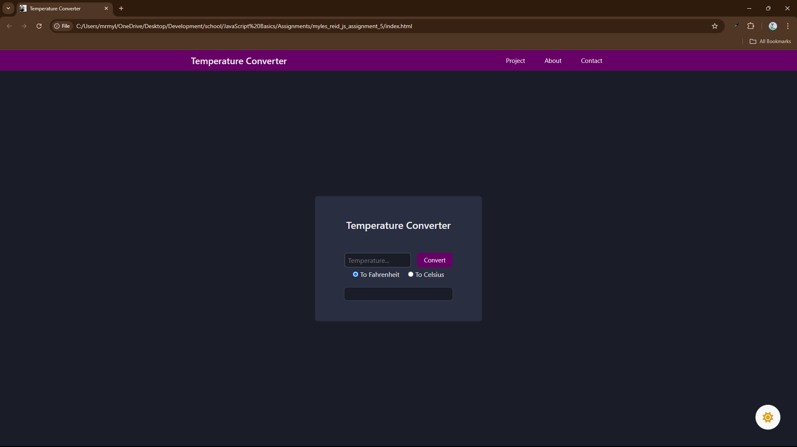
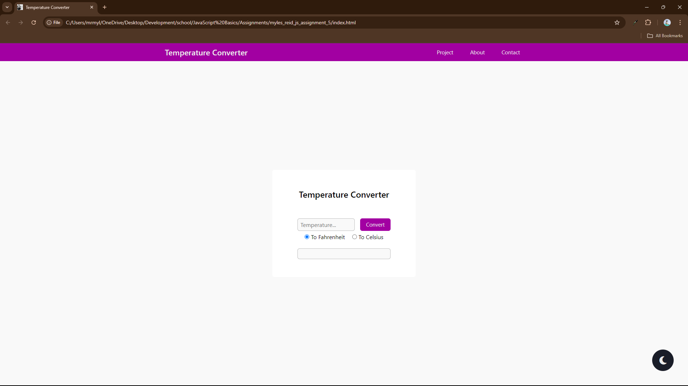

# Simple Temperature Converter

As simple as it gets. Put the desired temperature that you wish to convert into 
the text box, select the direction you wish to convert (C to F or F to C) and 
click the button!

---

## Features

- Light/dark mode toggle
- Semi responsive
    The hamburger menu shows up, but does not function at this moment.
- Simple interface
- Easy to understand

---

## Lessons Learned

Learnt how to switch out an icon proper for a light/dark toggle, as well as learnt 
that there are multiple ways to force a default toggle on radio buttons. There 
were a few challenges along the way that a quick google search or GPT question 
pulled me back to my senses and made me just shake my head at how dumb I was. 
Overall, not a super complex project.

---

## Screenshots

---

## Badges

  
   
  

